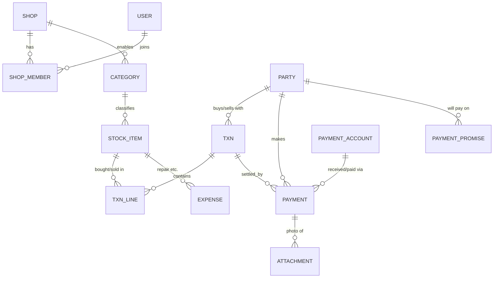

# Device Buy/Sell Tracker: Database Schema (v0.4)

Companion to `hafeez-center-app-spec.md` (v0.6).  
Local DB: **Room (SQLite)** — source of truth on owner/staff devices.  
Cloud: **Firebase Auth + Firestore + Cloud Storage** (v1).

---

### Changes in v0.4
- Owner decisions: photos **local-only** v1 (A); **8 locales** + `shops.preferred_language` (B); receipt **logo** (C); slow stock **30** (D); **Blaze** yes (E).
- Removed §9 security rules outline (implemented in app repo only, per owner).
- Firestore path structure updated to 6 segments (`shops/{shopId}/scopes/{scope}/{collection}/{id}`) for valid document paths.
- Payment scope linked to transaction scope (`SALE_RETURN` refund = `PUBLIC`) to ensure correct 0 net balance on staff devices.

### Changes in v0.3
- Lot-based quantity, standalone payments + FIFO, sync protocol (§8), Firestore mapping (§7).
- Party balance query includes returns; `shops.slow_stock_days`, `app_meta`, invites.

### Changes in v0.2
- Staff buy entries; `payment_promises`; `payment_accounts`; `attachments`.

---

## 1. Design Principles

1. **UUID primary keys** everywhere (no auto-increment).
2. **Money = INTEGER** minor units (PKR paisa = amount × 100).
3. **Dates = epoch ms UTC**; UI uses shop timezone (default `Asia/Karachi`).
4. **Ledger derived** — no stored party balance.
5. **Payments append-only** — correct via reversing payment.
6. **Soft delete only** (`deleted_at`), owner only.
7. **Cost vault** — purchase cost, OUT payments, PAY promises, expenses, vault attachments never sync to staff (§6).
8. **One row per purchase cycle** per UNIQUE device; buy-back = new row, same identifier allowed.
9. **Promises ≠ payments** — promises track commitment dates only.
10. **Images = files** — DB holds paths + upload state.

### Common columns (every synced table)

| Column | Type | Notes |
|---|---|---|
| `id` | TEXT PK | UUID |
| `shop_id` | TEXT | tenant key |
| `created_at`, `updated_at` | INTEGER | epoch ms |
| `created_by`, `updated_by` | TEXT | user id |
| `deleted_at`, `deleted_by` | INTEGER / TEXT NULL | soft delete |
| `rev` | INTEGER | +1 on each edit |
| `origin_device_id` | TEXT | creating device |
| `sync_state` | TEXT | **local only**: `PENDING` / `SYNCED` / `CONFLICT` |

---

## 2. Entity Relationships



---

## 3. Tables

### 3.1 `shops`
`name`, `phone`, `address`, `currency` (default `PKR`), `timezone` (default `Asia/Karachi`), `owner_user_id`, `plan` (default `free`), `receipt_footer`, `logo_uri`, `slow_stock_days` (INTEGER, default **30**), `preferred_language` (TEXT NULL — BCP-47: `en`, `ur`, `es`, `fr`, `hi`, `ar`, `zh-Hans`; NULL = device locale), `cloud_photo_upload_enabled` (BOOL, default **false**; v1 photos local-only per spec A)

### 3.2 `users` (global; Firestore `users/{uid}`)
`id`, `display_name`, `email`, `phone`, `photo_url`, `active_session_id`, `active_device_id`, `session_updated_at`

### 3.3 `shop_members`
`user_id`, `role` (`OWNER` / `STAFF` / `PARTNER`), `status` (`INVITED` / `ACTIVE` / `REMOVED`), `invited_by`, `joined_at`  
Unique: (`shop_id`, `user_id`). A user may have multiple rows (multiple shops).

### 3.4 `invites`
`code` (PK, 8 chars A-Z2-9), `role`, `created_by`, `expires_at` (default created + 7d), `used_by`, `used_at`  
Max 5 unused non-expired invites per shop (enforced in app).

### 3.5 `categories`
`name`, `preset_key`, `identifier_type` (`IMEI` / `SERIAL` / `NONE`), `tracking_mode` (`UNIQUE` / `QUANTITY`), `field_schema` (JSON), `enabled`, `sort_order`

### 3.6 `parties`
`name`, `phone`, `cnic`, `address`, `notes`, `type_hint` (`CUSTOMER` / `SUPPLIER` / `BOTH`), `id_photo_uri` (unused in v1 UI)

### 3.7 `stock_items` (PUBLIC, no cost columns)
`category_id`, `brand`, `model`, `identifier`, `identifier2`, `attributes` (JSON), `condition`, `quantity`, `remaining_qty`, `status` (`IN_STOCK`, `SOLD`, `RETURNED_TO_SUPPLIER`, `WRITTEN_OFF`), `purchase_line_id`, `stocked_at`, `has_conflict`, `notes`

Indexes: (`shop_id`, `status`), (`shop_id`, `identifier`), (`shop_id`, `stocked_at`), (`shop_id`, `category_id`, `brand`, `model`, `status`) for lot picking.

### 3.8 `txns`
`type` (`PURCHASE`, `SALE`, `SALE_RETURN`, `PURCHASE_RETURN`), `party_id`, `txn_date`, `total_amount`, `receipt_no`, `exchange_group_id`, `original_txn_id`, `scope`, `note`

### 3.9 `txn_lines`
`txn_id`, `stock_item_id`, `quantity`, `unit_price`, `line_total`, `scope`

### 3.10 `payments`
`txn_id` (NULL = standalone), `party_id`, `direction` (`IN` / `OUT`), `amount`, `method`, `account_id`, `reference_no`, `counterparty_info`, `pay_date`, `reverses_payment_id`, `scope`, `note`

**Standalone + allocation (Decided):** Ledger uses all payments. **Display** unpaid per txn:
`txn.total − Σ payments(txn_id = txn) − FIFO_share(standalone payments for party)`  
FIFO: standalone IN applies to oldest unpaid SALE by `txn_date`, then PURCHASE for supplier OUT (owner only).

### 3.10a `payment_accounts`
`label`, `type` (`CASH` / `BANK` / `WALLET`), `details`, `is_default`, `active` — default Cash at setup.

### 3.10b `payment_promises`
`party_id`, `txn_id`, `direction` (`RECEIVE` / `PAY`), `amount` (unpaid at creation), `promised_date`, `status` (`OPEN`, `KEPT`, `RESCHEDULED`, `CANCELLED`), `previous_promise_id`, `scope`, `note`

**Partial pay:** Do not edit `amount`; auto **KEPT** when linked txn unpaid = 0. UI may show derived `remaining` for txn.

### 3.10c `attachments`
`entity_type`, `entity_id`, `kind`, `local_path`, `remote_path`, `mime_type`, `size_bytes`, `width`, `height`, `upload_state` (`LOCAL_ONLY`, `PENDING`, `UPLOADING`, `UPLOADED`, `FAILED`), `scope`  
Cap 3 per payment. v1 UI: payments only. Compress on device (longest side ~1280 px, JPEG ~80). **v1 (A):** save to app-private storage only; `upload_state = LOCAL_ONLY`; no Cloud Storage worker until `cloud_photo_upload_enabled` is true.

### 3.11 `expenses` (VAULT)
`stock_item_id` (NULL = shop-level), `category`, `amount`, `expense_date`, `note`  
Categories: `RENT`, `ELECTRICITY`, `SALARY`, `REPAIR`, `ACCESSORIES`, `COMMISSION`, `OTHER`

### 3.12 `audit_log`
`entity_type`, `entity_id`, `action` (`CREATE`/`UPDATE`/`DELETE`/`REVERSE`), `before_json`, `after_json`, `user_id`, `at`, `scope`

### 3.13 `conflicts`
`stock_item_id`, `txn_id_a`, `txn_id_b`, `status` (`OPEN`/`RESOLVED`), `resolved_by`, `resolved_at`, `resolution_note`

**Resolution options (owner):** mark one sale as void (soft-delete txn + reverse payments) **or** convert one sale to different item (manual, rare) **or** keep both and note external settlement (status RESOLVED, both txns remain).

### 3.14 Local-only tables

**`app_meta`** (single row): `device_code` (4 chars), `device_id` (UUID), `receipt_seq` (INTEGER), `active_shop_id`, `app_pin_hash` (optional)

**`sync_outbox`:** `id`, `entity_type`, `entity_id`, `op` (`UPSERT`/`DELETE`), `payload_json`, `created_at`, `attempts`, `last_error`, `session_id_at_enqueue` — never cleared on logout.

**`sync_cursor`:** `collection_path`, `last_pulled_at`, `last_rev_seen` (optional)

### 3.15 Cloud-only summaries (VAULT)
`shops/{shopId}/scopes/vault/summaries/{yyyy-MM-dd}`: `revenue`, `cost`, `expenses`, `net_profit`, `units_sold`, `top_models` (array), `updated_at`, `written_by_device_id`

Owner device recomputes after sync when local day changes or on manual "Refresh summary". Partner reads this doc only.

---

## 4. Key Rules

### Exchange / trade-in
(Same worked example as v0.2 — SALE + PURCHASE + TRADE_IN payments, shared `exchange_group_id`.)

### Returns
- `SALE_RETURN`: `original_txn_id`, restock UNIQUE or qty, refund OUT, adjust promises. Refund OUT payment uses `scope = PUBLIC` to maintain correct 0 party balance on staff devices.
- `PURCHASE_RETURN`: supplier return, `RETURNED_TO_SUPPLIER`.

### Duplicate identifier (buy)
- `IN_STOCK` match → strong warning + open existing.
- `SOLD` match → buy-back history.
- Invalid IMEI Luhn → warn, allow override with audit note.

### Double sale conflict
Two non-returned SALE lines on same UNIQUE `stock_item` → `has_conflict`, `conflicts` OPEN.

### Quantity lots
One lot per purchase. Sale reduces `remaining_qty`; pick lot or default FIFO by `stocked_at`. No average cost.

### Write-off
Owner sets `WRITTEN_OFF`; optional expense; no sale.

---

## 5. Cost Vault and Sync Scope

| Scope | Contents | Owner | Partner | Staff |
|---|---|---|---|---|
| PUBLIC | categories, parties, stock_items, payment_accounts, SALE/SALE_RETURN txns/lines, IN payments & SALE_RETURN refund payments, RECEIVE promises, public attachments | sync | sync | sync |
| VAULT | PURCHASE/PURCHASE_RETURN, supplier OUT payments, PAY promises, expenses, summaries, vault audit, vault attachments | sync | sync | **never** |

**Payment Scope Rule:** Payments linked to `SALE` or `SALE_RETURN` inherit `scope = PUBLIC`. Standalone customer payments set `scope = PUBLIC`. Supplier purchase payments set `scope = VAULT`.

Staff buy: write local vault → upload → **purge vault rows** from staff DB after server ACK; public `stock_items` row remains without cost.

Partner: read vault + public; **no writes**.

---

## 6. Core Queries

**Party balance** (positive = party owes shop)

```sql
SELECT p.id, p.name,
  COALESCE((SELECT SUM(
    CASE t.type
      WHEN 'SALE' THEN t.total_amount
      WHEN 'SALE_RETURN' THEN -t.total_amount
      WHEN 'PURCHASE' THEN -t.total_amount
      WHEN 'PURCHASE_RETURN' THEN t.total_amount
      ELSE 0 END)
    FROM txns t
    WHERE t.party_id = p.id AND t.deleted_at IS NULL), 0)
  - COALESCE((SELECT SUM(CASE WHEN y.direction = 'IN' THEN y.amount ELSE -y.amount END)
    FROM payments y
    WHERE y.party_id = p.id AND y.deleted_at IS NULL), 0) AS balance
FROM parties p
WHERE p.shop_id = :shopId AND p.deleted_at IS NULL;
```

**Staff-visible customer balance:** same formula but restrict `t.type` to `SALE`/`SALE_RETURN` and payments `scope = 'PUBLIC'` only (removing `direction = 'IN'` restriction so customer refunds on `SALE_RETURN` correctly calculate 0 balance on staff devices).

**Capital in stock, slow stock, overdue promises, per-account movement** — unchanged from v0.2 except slow stock uses `shops.slow_stock_days`.

**Profit (UNIQUE):** v0.2 query + subtract `SALE_RETURN` line totals in date range via repository.

**Monthly net profit:** device profit in range − shop-level expenses in range.

---

## 7. Firestore Mapping (v1)

```
users/{uid}
shops/{shopId}                                  // shop profile fields
shops/{shopId}/members/{uid}
shops/{shopId}/invites/{code}
shops/{shopId}/scopes/public/{collection}/{id}  // parties, categories, stock_items, txns, txn_lines, payments, promises (RECEIVE), payment_accounts, attachments (public)
shops/{shopId}/scopes/vault/{collection}/{id}   // purchase txns/lines, OUT payments, PAY promises, expenses, audit, attachments (vault)
shops/{shopId}/scopes/vault/summaries/{yyyy-MM-dd}
```

- Document id = entity UUID.
- Paths use 6 segments (even number) for valid Firestore document locations.
- `txn_lines` stored nested under txn **or** subcollection `txns/{id}/lines/{lineId}` — pick one in code (recommended: subcollection for rule simplicity).
- Every write includes `rev`, `updated_at`, `updated_by`; server rejects if `session_id` ≠ `users.active_session_id`.

**Storage paths:**  
`shops/{shopId}/public/attachments/{id}.jpg`  
`shops/{shopId}/vault/attachments/{id}.jpg`

---

## 8. Sync Protocol

### Push (owner/staff)
1. WorkManager drains `sync_outbox` FIFO.
2. For each op: Firestore transaction or batch set with merge on `rev` (reject if server `rev` > client unless conflict handler).
3. Attach `session_id` from Firebase Auth custom claim or `users` doc read once per batch.
4. On `SESSION_STALE`: show re-login; **retain outbox**.
5. Vault purge on staff: after successful push of vault doc, delete local vault rows for that entity id.

### Pull
1. Query `updated_at > last_pulled_at` per collection path (public vs vault by role).
2. Apply to Room; tombstones (`deleted_at` set) hide rows in UI.
3. Run conflict detector for stock_items / sale lines after pull.

### Partner device
No Room outbox; periodic pull + summary doc; no vault purge.

### Non-conflict concurrent edits
Same row edited on two devices: higher `rev` wins; if equal `rev`, higher `updated_at` wins; audit both in `audit_log` if detectable.

---

## 9. Room Migrations

- `schema_version` in `app_meta`; use Room auto-migrations where possible.
- v1 ships at version 1; bump on each release with migration tests.

---

## 10. Decisions (locked for v1)

1. Firestore + Firebase Auth; Blaze linked (E). Cloud Storage only when photo cloud upload enabled.
2. Payment photos **local-only** at launch (A); `upload_state = LOCAL_ONLY` by default.
3. Eight UI locales + `preferred_language` (spec §15).
4. Receipt shop logo supported (`logo_uri`) (C).
5. Lot-based QUANTITY; standalone payments + FIFO display.
6. Staff buy with vault purge after sync (scope §5; Firestore rules live in app repo, not this doc).
7. Summaries written by owner device until Cloud Function.

---

## 11. Open item

**Pilot shop (F):** TBD before release candidate (spec §14).

---

## 12. Next implementation artifact

Room entities/Daos from this schema; `firestore.rules` in app repo; wireframes per spec §11; `strings.xml` for all v1 locales.
