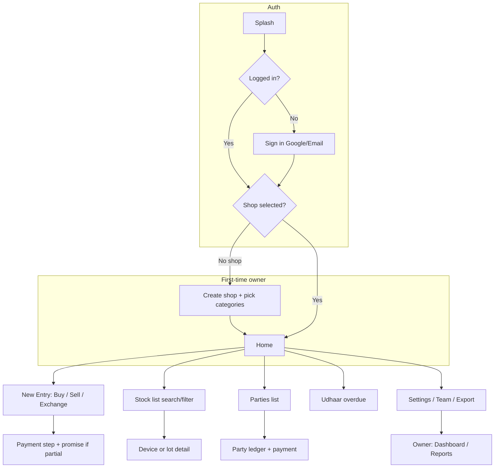

# Device Buy/Sell Tracker: Project Spec (v0.6)

Working name: **Hafeez Center App**  
Platform: Android (Play Store release)  
Status: **Ready for implementation** — only [pilot shop (F)](#14-owner-decisions) TBD.

Companion schema: `hafeez-center-app-schema.md` (v0.4).  
Engineering bootstrap: [`NEW_APP_BOOTSTRAP_RULES.md`](file:///Users/a1702/Desktop/personal/PlaystoreApps/NEW_APP_BOOTSTRAP_RULES.md) — adopted in [§17](#17-android-engineering-bootstrap).

Decisions are marked **Decided** (locked for v1) or **Later** (explicitly out of v1).

---

## 14. Owner decisions

| # | Topic | Status |
|---|--------|--------|
| A | **Payment photos** | **Decided:** v1 **local-only** (`LOCAL_ONLY`). Optional cloud upload later via Settings when owner enables (`cloud_photo_upload_enabled`); not required for launch. |
| B | **Languages** | **Decided:** v1 ships **8 locales** (see §15). |
| C | **Receipt logo** | **Decided:** yes — shop logo on PDF/image receipts (§3.17). |
| D | **Slow-stock default** | **Decided:** **30** days (`shops.slow_stock_days`; editable in Settings). |
| E | **Firebase Blaze** | **Decided:** yes — link billing for budget alerts; Storage ready when cloud photos are enabled. |
| F | **Pilot shop (UAT)** | **TBD** — assign before release candidate. |

---

## 1. Overview

A mobile app for shops that buy and sell used/new devices (the Hafeez Center market model). It replaces the paper register: every purchase, sale, payment and expense is recorded in the app, and profit/loss is calculated automatically, per device and per month.

- **Decided:** New standalone product (separate from the POS app), published on Play Store for **multiple shop owners**.
- **Decided:** Not phone-only. Must support phones, laptops, iPads, PS5, Xbox and similar items.
- **Decided:** App is **totally free for now**. Monetization is a later decision.
- **Decided:** Backend **Firebase Auth + Firestore + Cloud Storage** for v1 (same stack as POS app). Reporting runs on Room SQL on owner/partner devices; no server-side SQL in v1.
- **Decided:** Android client follows org bootstrap (§17): Jetpack Compose, MVVM + Clean Architecture, Gradle version catalog, Firebase BOM baseline.
- **Decided:** Primary users are **shopkeepers with little or no formal education**. UI/UX must be **simple, visual, and in everyday language** — see **§19** (non‑negotiable for every screen).

---

## 2. Product Categories (Configurable)

### Decided
- During first-time setup, the user selects which categories their shop trades in.
- The same selection can be edited later in Settings.
- The **“Naya record” / New entry** screen shows enabled categories as **large tappable cards with icons** (not a tiny dropdown-only control).
- Each category carries its own **field template** (`field_schema` in DB), not just a name.
- Ship **10 preset categories** (see §2.1). Allow **custom categories** in Settings (no app update).
- **Quantity-based categories** (e.g. Accessories): **one stock row per purchase lot**, not average cost. Each sale picks a lot and reduces `remaining_qty` (see §3.12).
- Common fields (price, date, party, status) live in normal columns. Category-specific fields live in JSON `attributes`.

### 2.1 Preset categories (v1)

| Preset key | Name | Identifier | Tracking | Required extra fields |
|------------|------|------------|----------|------------------------|
| `mobile` | Mobile | IMEI | UNIQUE | storage (select), condition (in attributes + column) |
| `tablet` | Tablet / iPad | IMEI or SERIAL | UNIQUE | storage, connectivity (WiFi/Cell) |
| `laptop` | Laptop | SERIAL | UNIQUE | processor, ram, storage |
| `console` | Console | SERIAL | UNIQUE | edition, controllers_count |
| `smartwatch` | Smartwatch | SERIAL | UNIQUE | size_mm |
| `earbuds` | Earbuds / Audio | SERIAL or NONE | UNIQUE | — |
| `accessories` | Accessories | NONE | QUANTITY | item_name (text) |
| `parts` | Parts / For Parts | NONE | QUANTITY | item_name |
| `camera` | Camera | SERIAL | UNIQUE | lens_kit |
| `other` | Other | NONE | UNIQUE | description |

Mobile preset includes optional: color, PTA approved (bool), battery health (%). IMEI **Luhn validation** on save (warn if invalid; allow override with note).

---

## 3. Core Features

### 3.1 Buy entry
- Category, device details (from template), identifier(s) (IMEI/serial; IMEI 2 optional)
- Purchase price, date
- Seller (Party), **CNIC and phone required on purchase** (text fields; no ID photo UI in v1)
- Payment: full or partial; partial creates supplier-side udhaar + optional `payment_promises` (vault for staff view rules)
- Duplicate identifier checks per schema §4

**UI notes (lay users):** Use a **step-by-step wizard** (max 4 steps with progress dots): (1) device type → (2) details + IMEI → (3) seller → (4) payment. Title example: **“Phone khareedna” / Buy device**. Field **IMEI** shows helper: *“15 digit number; Settings → About phone par likha hota hai”* + optional diagram placeholder. **CNIC** helper: *“13 digits, dashto ke baghair bhi chalega”*. Money fields show **digits + “Rs”** and optional **amount in words** under field (e.g. *“Pachas hazar”*) for large amounts. Primary button: **“Save karein”** — never “Submit transaction”.

### 3.2 Sell entry
- Link to in-stock UNIQUE item, or lot + qty for QUANTITY categories
- Buyer (Party), sale price, date, payment received / pending
- Status: `IN_STOCK` → `SOLD` (UNIQUE) or reduce `remaining_qty` (lot)
- **Decided:** Staff may record sales and customer udhaar; no owner approval in v1

**UI notes:** Start with **“Stock se phone choose karein”** — search by IMEI last 4 digits or name; big list rows (photo placeholder, model, IMEI tail). If user taps **Sell** from home without picking stock, show friendly empty state: *“Pehle stock mein phone hona chahiye — khareedari record karein”*. Payment step mirrors buy flow.

### 3.3 Device / lot page
Timeline: purchased → expenses → sold → return / write-off.  
Profit (owner/partner): sale − purchase cost − device-linked expenses. Returns adjust revenue in reports.

**UI notes:** Timeline as **vertical story with icons** (cart → wrench → cash → undo), not a table. Owner sees **“Is phone par kitna faida hua?”** with green/red number; staff see timeline **without** buy price or profit lines. Tap any step for plain summary: *“12 Jan ko Ali ne Rs 85,000 mein khareeda”*.

### 3.4 Party ledger
- Single **Party** table for customers and suppliers.
- Net balance from txns + payments (derived, never edited).
- **Receive payment / Pay supplier** from ledger: creates append-only `payments` (see §3.13).
- Staff: customer **receive** payments and balances on **sale side only** (no supplier pay-out UI).

**UI notes:** Menu name **“Khata / Hisaab”** — subtitle *“Kaun kitna dena / lena hai”*. List shows **name, phone, one big balance line**: *“Us ne Rs 20,000 denay hain”* (owe shop) or *“Hum ne Rs 5,000 denay hain”* (shop owes). Avoid “debit/credit”. Actions: **“Paisay lein”** (customer paid) and **“Paisay dein”** (owner pays supplier — owner only).

### 3.5 Dashboard & reports (owner/partner)
- **Decided:** Date ranges: Today, This week, This month, Custom — boundaries use shop timezone (`Asia/Karachi` default).
- Metrics: revenue, cost, expenses, net profit, units sold, top models, capital in stock, slow stock (default 30 days).
- **SALE_RETURN** / **PURCHASE_RETURN** included in revenue/cost via repository layer (not raw SALE-only SQL).
- **Staff home (Decided):** today’s sale count + total sale amount (public data only); no profit, no dashboard.

**UI notes:** Owner dashboard uses **plain cards**, not dense charts first: *“Aaj ki sales”*, *“Is mahine ka munafa”*, *“Stock mein band paisa”*. Each card has **(?) help** one tap: e.g. munafa = *“Sales − khareed − kharch”*. Avoid “revenue”, “COGS”, “capital” in primary labels — use glossary (§19.4) in secondary/help text only.

### 3.6 Export / share
- Excel and PDF generated **on device** (owner/partner; staff cannot export).
- **Decided leave policy:** Settings → Export all shop data (ZIP: JSON + CSV + optional local photos folder manifest). Owner-only. Soft-deleted rows included with `deleted_at` flag.
- Account deletion: request via in-app email to support; owner confirms; cloud docs marked deleted; documented in Privacy Policy.
- WhatsApp: share intent for PDF/image receipt.

### 3.7 Hafeez Center specifics
- Seller CNIC + phone on every purchase
- IMEI duplicate warnings (in stock = strong; sold = buy-back info)
- Udhaar on buyer and supplier side
- Optional PTA bool on mobile; receipt may show "PTA: Yes/No" when set (**Later:** PTA tax workflow)

### 3.8 Exchange / trade-in (**Decided**, day one)
One flow creates linked SALE + PURCHASE with shared `exchange_group_id` and TRADE_IN payments (schema worked example).

**UI notes:** Single entry point **“Purana de kar naya lena” / Exchange**. Short explainer at top: *“Customer ka purana phone shop khareed legi, naya phone bech diya — ek hi screen par dono”*. Show simple diagram (old phone → shop → new phone). Ask **purana phone ki qeemat** and **naya phone ki qeemat** separately; app computes cash difference in big text: *“Customer ab Rs ___ cash dega”*.

### 3.9 Payment details
- Amount, method, shop `payment_account`, optional reference, note, optional photos (§3.11).
- Cheque = reference + note only in v1 (**Later:** clearing status).

**UI notes:** Payment method as **large chips with icons** (cash, bank, Easypaisa, JazzCash, cheque, purana phone / exchange). **“Kis account mein aaya?”** — default Cash pre-selected. Reference field label: *“Transaction ID / slip number (optional)”*.

### 3.10 Udhaar and promises
- On partial pay at sale/purchase save: prompt **"Baqi kab dega?"** → create one **OPEN** promise per txn with `txn_id`, `amount` = unpaid remainder at save time.
- **Partial payments (Decided):** Payments reduce party balance. Per-txn unpaid = txn total − sum(payments where `txn_id` = that txn) − FIFO allocation of standalone payments (oldest txn first, sale/purchase by `txn_date`). When txn unpaid hits 0, linked OPEN promise → **KEPT** (auto). Owner may mark KEPT/CANCELLED manually.
- Reschedule: old → `RESCHEDULED`, new row with `previous_promise_id`.
- Overdue list, due-date local notification, WhatsApp prefilled reminder.
- **Later:** per-party credit limit.

**UI notes:** Never use “promise” alone in UI — use **“Baqi kab denge?”** with amount highlighted: *“Rs 15,000 baqi — 10 March tak”*. Date picker: **calendar + “Kal / Agle hafte” quick chips**. Overdue list title: **“Late payments” / “Jo date nikal gayi”**. WhatsApp button: **“Yaad dilayein WhatsApp par”**.

### 3.11 Photo attachments
- Payment screen: camera or Photo Picker; max **3** images; compress per schema.
- **Decided (A):** v1 **local-only** — no Cloud Storage upload at launch. `upload_state` stays `LOCAL_ONLY`; optional cloud path when owner toggles on later (Blaze already approved per E).

**UI notes:** Button **“Photo / slip lagayein”** with camera and gallery icons; after capture show thumbnail + *“Phone par save ho gaya”* (no “upload” jargon in v1).

### 3.12 Quantity lots (**Decided**)
- Each purchase creates one `stock_items` lot (`quantity` = N, `remaining_qty` = N).
- Sale: user picks lot if multiple match (same category + brand + model + optional attributes); default sort **FIFO** (`stocked_at` ascending).
- Partial qty sale allowed. Profit = (unit sale price − lot unit cost) × qty sold.

**UI notes:** For chargers/covers, label **“Kitni quantity?”** with +/- stepper (min 1). If multiple lots exist, show **“Kaun si batch?”** with date bought — helper: *“Purani batch pehle bechne ki salah”* (FIFO); do not say “FIFO”.

### 3.13 Standalone ledger payments (**Decided**)
- `payments.txn_id` **NULL** = general settlement (customer pays old udhaar, or supplier payment not tied to one bill).
- UI: from Party ledger → "Receive" / "Pay" → amount + method + account; optional **Link to bill** dropdown listing open txns with unpaid remainder (if user picks one, set `txn_id`).
- Ledger math unchanged: all payments sum by party; FIFO allocation used only for display (which bill was paid down).

**UI notes:** Optional **“Kis bill par lagaya?”** dropdown — if skipped, show *“Paisay account par adjust ho jayenge (purani bill pehle)”* in small helper text.

### 3.14 Write-off (**Decided**, owner only)
- From device page: Mark written off → `status = WRITTEN_OFF`, optional vault `expense` (e.g. loss), reason note, audit log. No sale txn. Does not restore quantity to a lot already at 0.

**UI notes:** Action **“Phone kharab / khatam — stock se nikalna”** (not “Write off”). Confirm dialog in plain language: *“Ye phone ab bech nahi sakte — theek hai?”* Reason chips: Chori, Kharab, Doosri wajah.

### 3.15 Returns (**Decided**)
- **Full return v1:** `SALE_RETURN` / `PURCHASE_RETURN`, restock or supplier return status, refund payment OUT/IN. Cancel or KEPT udhaar promise on linked txn via repository rules.
- **Later:** partial return, restocking fee.

### 3.16 Receipt numbering (**Decided**)
- Format: `{deviceCode}-{seq}` (e.g. `K7M2-1042`).
- `deviceCode`: 4 alphanumeric chars assigned once per app install (local `app_meta` table).
- `seq`: monotonic per device per shop, stored locally; duplicates across devices acceptable; display sorts by `txn_date` + `receipt_no`.

### 3.17 Receipt content (**Decided** default template)
- Header: shop name, phone, address; **shop logo** when `logo_uri` is set (C).
- Body: receipt no, date, party name/phone, line items (brand, model, identifier if UNIQUE), qty, line total, txn total, payments on txn, **remaining balance** (party net, sale-side only on staff copy). Labels follow active app language (§15).
- Footer: `receipt_footer` from shop settings (owner may write footer in any language).
- Staff-shared PDF: **no purchase cost, no profit**; customer copy same as staff for sales.

**Logo guidelines (C):** PNG or JPEG; max **200 KB**; recommended min width **400 px**; aspect ratio **1:1** or **3:1**; displayed on receipt at max height **72 pt**, centered above shop name. Setup: Settings → Shop → Upload logo (Photo Picker).

---

## 4. Users, Roles and Permissions

### Decided
- Multiple users per shop; one user may belong to **multiple shops** (switch shop in Settings → requires sync flush warning if outbox non-empty).
- **One active device per user**; stale session rejected on sync writes.
- Roles: **Owner, Staff, Partner** (view-only).
- Staff: buy/sell, customer payments, customer udhaar; **no** supplier payout screen, **no** profit/cost, **no** export, **no** delete, **no** user management.
- Partner: read-only cloud dashboard; **no writes** in Firestore rules.

### Permission matrix

| | Owner | Staff | Partner |
|---|---|---|---|
| Buy/sell entry | Yes | Yes | No |
| Customer ledger payment | Yes | Yes | No |
| Supplier payout | Yes | No | No |
| See purchase price / profit | Yes | No | Yes |
| Dashboard / full reports | Yes | No | Yes |
| Today sales summary | Yes | Yes (amount only) | Yes |
| Export (PDF/Excel/data ZIP) | Yes | No | Yes |
| Manage users / settings / write-off / soft delete | Yes | No | No |
| Optional app PIN | Yes | Yes | Yes |

### Invites (**Decided**)
- 8-character code, A-Z2-9 (no ambiguous 0/O); expires **7 days**; single use; max **5 active invites** per shop.

### Partner UX (**Decided**)
- **Last updated** = `max(shop summaries.updated_at, last successful pull timestamp)` shown on dashboard.
- Optional daily summary push (FCM): reads vault summary doc for yesterday.

### Auth (**Decided**)
- v1: Google Sign-In + email/password (Firebase Auth).
- **Later:** phone OTP.

---

## 5. Single Active Session

- Login sets `users.active_session_id` + `active_device_id` in Firestore.
- Old device: snapshot listener → logout UI; if offline, stale writes rejected at sync with `SESSION_STALE`.
- **Never** wipe `sync_outbox` on logout. Block logout if outbox is non-empty unless user chooses "Logout anyway (will sync when back)".

---

## 6. Offline-First Architecture

### Decided
- **Room** = UI source of truth on owner/staff devices.
- **WorkManager** push/pull to Firestore; Partner app is online-first (Firestore direct + cache).

### Sync protocol summary (detail in schema §8)
- UUID ids; monotonic `rev` per row; last-write-wins on scalar fields if same `rev` race (rare); conflicts table for double-sale only.
- Soft deletes sync as `deleted_at` tombstones.
- Staff vault rows: upload then **purge local vault** after ACK; keep public copy effects (e.g. new stock item shell without cost).

### Conflict handling
- Double sale same UNIQUE item → `has_conflict`, `conflicts` row, owner resolves in app (**Decided:** human decision; options documented in schema §4).

---

## 7. Money and Data Integrity

- Append-only payments; reversals via `reverses_payment_id`.
- Balances calculated, not stored.
- Soft delete owner-only; audit log on create/update/delete/reverse.
- Shop vs device expenses separated.

---

## 8. Cost Control (Free Tier)

- Partner dashboard: one summary doc read per day view.
- Firebase **budget alert** at install/setup checklist.
- Blaze linked (E); Cloud Storage used only when cloud photo upload is enabled (after A: local v1).
- `shops.plan = free` for all v1 tenants.

---

## 9. Monetization

**Later** for product pricing (seats, cloud backup, partner access).  
**Decided for v1:** No AdMob, no Play Billing, no “remove ads” SKU — see §17.5 (differs from generic bootstrap defaults).

---

## 10. Security & Compliance (**Decided** for v1)

- Enforce roles in **Firestore + Storage rules** in the implementation repo (must match vault scope in schema §5). No separate rules document in the schema file.
- CNIC stored as plain text in Room/Firestore with shop-scoped access (**Later:** field-level encryption).
- Privacy Policy + Play Data Safety: personal info (name, phone, CNIC), photos, not sold; deletion via §3.6.
- Optional **app PIN** (4–6 digits) on cold start; biometric unlock if available.
- **Later:** root detection warning only (non-blocking).

---

## 11. Screen Flow (v1)



**Home (owner):** max **4 big action buttons** (Sell, Buy, Khata, Stock) + smaller row for Exchange and Udhaar list. Badges with words: *“2 late payments”*, *“1 problem — same phone do bar becha”*. Sync chip: **“Saved on phone ✓”** / **“Sending to cloud…”** / **“Needs internet”** — never “sync conflict” without explanation.

**Home (staff):** Same layout minus owner-only items; **“Aaj ki sales: 3 — Rs 1,25,000”** in one banner.

**First-time setup (lay-friendly):** Short **3-screen tutorial** (skippable): (1) buy records stock, (2) sell updates khata, (3) partial payment = baqi date. Use illustrations, minimal text, voice-over **Later**.

---

## 12. Build Order (revised)

| Phase | Scope | Exit criteria |
|-------|--------|----------------|
| **P0** | Repo bootstrap (§17 checklist), Room schema, repositories, UUID + shopId, auth stub (single owner) | Buy/sell UNIQUE offline, balances correct |
| **P1** | Parties, payments, promises, lots QUANTITY, exchange | Acceptance §13 scenarios 1–8 pass |
| **P2** | Sync outbox, Firestore public + vault, session id, staff purge | Two devices sync; staff never retains vault |
| **P3** | Roles, invites, partner read-only app | Matrix §4 enforced server-side |
| **P4** | Dashboard, reports, summaries writer, exports, receipts | Owner PDF + Excel |
| **P4b** | **§19 UX pass** on all P0–P4 screens (copy, help, empty states, UAT §13.11–15) | Pilot shop can complete buy/sell/khata without training |
| **P5** | FCM, udhaar due notifications, partner daily summary, `RatingManager`, `STORE_LISTING.md`, Play release | §13 full checklist |

---

## 13. Acceptance checklist (UAT)

1. Trade-in: cash + trade-in balances net zero; new item in stock at trade-in value.
2. Double offline sale → conflict flagged; both txns exist.
3. Payment reversal chain restores balance.
4. Staff buy → sync → vault purged on staff device; owner sees cost.
5. Forced logout with pending outbox → data eventually syncs.
6. Promise reschedule chain; overdue query correct in Karachi midnight.
7. Lot partial sale; FIFO default; profit matches formula.
8. Standalone payment FIFO display; optional txn link sets `txn_id`.
9. SALE_RETURN restocks and adjusts dashboard month.
10. Write-off removes from available stock without sale.
11. **Lay user:** New staff member completes one buy + one partial sale + khata payment with **no verbal instructions** (think-aloud optional).
12. **Lay user:** Every form field on buy/sell path has visible **helper or example** (§19.3).
13. **Lay user:** Error messages state **what to do next** in one sentence (§19.5).
14. **Lay user:** Urdu (or selected language) matches **Grade 6 reading level** — reviewed by native speaker, not literal English calques.
15. **Accessibility:** Touch targets ≥ **48 dp**; body text ≥ **16 sp**; contrast WCAG AA.

---

## 15. Localization (**Decided**, B)

v1 includes full UI strings (not English-only shell) for:

| Code | Language | RTL |
|------|----------|-----|
| `en` | English | No |
| `ur` | Urdu | Yes |
| `es` | Spanish | No |
| `fr` | French | No |
| `hi` | Hindi | No |
| `ar` | Arabic | Yes |
| `zh-Hans` | Chinese (Simplified) | No |

- **Implementation:** Android `strings.xml` per locale; `values-ur`, `values-es`, `values-fr`, `values-hi`, `values-ar`, `values-zh-rCN` (or `b+zh+Hans`). Maintain **`STORE_LISTING.md`** in project root with Play copy + localized release notes (per bootstrap §8; all eight v1 locales).
- **Selection:** Settings → Language → system default or pick one; stored in `shops.preferred_language` (NULL = follow system).
- **RTL:** `android:supportsRtl="true"`; mirror navigation where required for `ur` and `ar`.
- **Numbers / money:** Always Western digits (0–9) with PKR formatting unless locale overrides grouping; dates use shop timezone + locale date format.
- **Quality:** Professional translation pass before Play release (no machine-only strings for `ur`/`ar`).
- **Plain language (Decided):** All locales use **short sentences**, **everyday words**, and **consistent terms** from §19.4. Urdu/Hindi copy may mix common Roman Urdu shop terms where shops already use them (*udhaar*, *khata*, *bechna*) — document choices in `LOCALIZATION_NOTES.md` in repo.
- **Later:** Traditional Chinese (`zh-Hant`), Punjabi, Bengali, or per-shop custom receipt language split.

---

## 16. Explicitly later (not v1)

Cheque clearing, credit limits, cash-drawer reconciliation, CNIC/ID photo capture, thermal printer, IMEI barcode scan, Cloud Function summaries (owner device writes summaries in v1), phone OTP, FBR/GST invoicing, commission party linkage, cloud payment photo upload (optional toggle after v1 if not shipped in first update).

---

## 17. Android engineering bootstrap

Source of truth for shared Play Store app conventions:

`/Users/a1702/Desktop/personal/PlaystoreApps/NEW_APP_BOOTSTRAP_RULES.md`

This section maps that blueprint to **Hafeez Center** so agents do not pull in ads/IAP that conflict with §9.

### 17.1 Architecture (**Decided**, from bootstrap)

| Item | Choice |
|------|--------|
| UI | **Jetpack Compose** + **Material 3** — tuned for §19 (large type, spacing, icons) |
| Structure | **MVVM + Clean Architecture** — `domain`, `data`, `presentation` |
| Activity | Single **`MainActivity`**, Compose navigation, **`enableEdgeToEdge()`** |
| Dependencies | **`gradle/libs.versions.toml`** (version catalog); pin to bootstrap baseline unless bumping intentionally |
| Local DB | **Room** (SQLite) — not in generic bootstrap; required here (schema doc) |
| Background work | **WorkManager** — sync outbox (§6) + notification scheduling |
| Images | **Coil** for Compose (shop logo, attachment thumbnails) |
| Splash | **`androidx.core:core-splashscreen`** |

Suggested module/package layout:

```text
app/
  presentation/   // Compose screens, ViewModels, theme
  domain/         // use cases, models (no Android)
  data/           // Room, Firestore, repos, sync, mappers
```

### 17.2 Version catalog baseline

Start from the **`[versions]` / `[libraries]` block in bootstrap** (AGP 9.2.x, Kotlin 2.4.x, Compose BOM 2026.08.x, Firebase BOM 33.9.x, WorkManager 2.9.x, Coil, Splashscreen, Play Review KTX, Play Services Auth).

**Add for this app** (same catalog file):

| Library | Purpose |
|---------|---------|
| Room (`room-runtime`, `room-ktx`, KSP compiler) | Offline-first schema |
| Navigation Compose | Single-activity routes |
| Firebase Messaging | Partner daily summary + optional FCM |
| Firebase Storage KTX | Post–v1 cloud payment photos (E) |
| CameraX or system intents | Payment photo capture / picker |

Do **not** add `play-services-ads`, `billing-ktx`, or `konfetti-compose` for v1 (§17.5).

### 17.3 Firebase & auth (**Decided**)

Bootstrap requires confirming auth up front — **confirmed for this product:**

- **Google Sign-In** + **email/password** (Firebase Auth); phone OTP later (spec §4).
- **Firestore** + **Storage** (when cloud photos enabled); **FCM** for partner summary pushes.
- Custom **`FirebaseMessagingService`**; notification channels:
  - **`IMPORTANCE_HIGH`** — sync/session alerts, conflict needs owner action
  - **`IMPORTANCE_DEFAULT`** — udhaar due reminders, partner daily summary
- Request **`POST_NOTIFICATIONS`** on API 33+ before scheduling udhaar/partner notifications.

### 17.4 Settings screen (**Decided**, bootstrap + Hafeez)

Standard settings from bootstrap, adapted for a B2B shop app:

1. **Theme** — System / Light / Dark (local DataStore).
2. **Language** — spec §15 (`preferred_language`).
3. **Shop** — name, logo upload (§3.17), receipt footer, slow-stock days, payment accounts (owner).
4. **Team** — invites, roles (owner).
5. **Notifications** — mute udhaar reminders; partner summary toggle (partner/owner).
6. **Account** — Sign out (respect outbox rules §5); **Delete account** with confirmation + Firebase Auth / Firestore cleanup per §3.6.
7. **Data** — Export ZIP (owner); sync status chip deep-link.
8. **Security** — optional app PIN (§10).
9. **About** — version name + build from **`BuildConfig`** (bootstrap §4).

**Not in v1 settings:** Premium / Remove ads (bootstrap §4) — replaced by nothing until §9 monetization.

### 17.5 Bootstrap items **not** in v1

| Bootstrap feature | Hafeez v1 |
|-------------------|-----------|
| AdMob (`AdMobManager`, banners/interstitials) | **Excluded** — app is free, no ads |
| Play Billing / `PremiumManager` / `premium_remove_ads` | **Excluded** |
| Jetpack Glance widgets (2x1 card + 1x1 icon) | **Later** — candidate: “New sale”, overdue count |
| `InactivityNotificationWorker` + fun message pool | **Later** — v1 uses **business** reminders (udhaar due, partner summary) only |
| Konfetti | **Excluded** unless a specific milestone UI is designed |

Re-enable any of these when product monetization or engagement strategy changes.

### 17.6 Play Store & engagement (**Decided** for launch polish)

- **`RatingManager`** (`play-review-ktx`): prompt after positive moments (e.g. 10th successful sale recorded, export completed). Cap: min **3 days** between prompts, max **3** lifetime per install (bootstrap §6).
- **`STORE_LISTING.md`**: English + `ur`, `es`, `fr`, `hi`, `ar`, `zh-Hans` release-note blocks (bootstrap §8 format).

### 17.7 Agent implementation checklist (merged)

Use with bootstrap checklist; `[x]` = required for Hafeez v1:

1. [ ] `gradle/libs.versions.toml` from bootstrap + Room/Navigation entries (§17.2)
2. [ ] ~~Confirm Firebase auth~~ — **done:** Google + email (§4)
3. [ ] Clean Architecture packages + single Activity Compose (§17.1)
4. [ ] Room entities/Daos from `hafeez-center-app-schema.md`
5. [ ] Settings per §17.4 (no premium/ads UI)
6. [ ] ~~PremiumManager & AdMobManager~~ — **skip v1**
7. [ ] `RatingManager` (§17.6)
8. [ ] ~~Glance widgets~~ — **skip v1**
9. [ ] WorkManager: **SyncWorker** + udhaar due / summary scheduling (not inactivity pool)
10. [ ] FCM service + channels (§17.3)
11. [ ] Localized `strings.xml` for all §15 locales + **plain-language** audit (§19)
12. [ ] `STORE_LISTING.md` (§17.6)
13. [ ] `firestore.rules` + Storage rules in repo (spec §10)
14. [ ] `LOCALIZATION_NOTES.md` — glossary §19.4 per locale
15. [ ] In-app **Help** screen (§19.6) on all roles

---

## 19. UX for lay users (**Decided**)

Most shop staff and many owners **do not read long English labels** or accounting terms. The app must feel like a **trusted notebook with pictures**, not ERP software.

### 19.1 Design principles

| Principle | Implementation |
|-----------|----------------|
| **One job per screen** | Wizard steps; avoid scrolling forms with 15 fields |
| **Big touch, big type** | Min 48 dp targets; 16 sp body, 20 sp+ headings; bold amounts |
| **Icons + color** | Every main action has icon; green = paisay aaye, red = denay hain, amber = baqi/late |
| **Show, don’t jargon** | User-facing copy from §19.4; hide internal names (Party, txn, vault, FIFO) |
| **Always confirm money** | Before save: full-screen summary *“Rs X lein / dein — theek hai?”* |
| **Safe mistakes** | No hard deletes; undo via reverse payment with plain explanation |
| **Works offline visibly** | §11 sync chip; never silent failure |
| **Help in context** | (?) on every non-obvious field; links to §19.6 topics |
| **Low literacy OK** | Numbers, icons, and **optional** Roman Urdu; avoid paragraphs |

### 19.2 Onboarding & empty states

- **Shop setup:** Shop name + phone only required first; categories as **pictures** (phone, laptop, game box).
- **Empty stock:** Illustration + *“Abhi koi phone stock mein nahi — pehli khareedari add karein”* + big **Buy** button.
- **Empty khata:** *“Jab koi baqi paisay honge yahan nazar ayenge”*.
- **Invite staff:** Owner sees *“Code copy karein aur WhatsApp par bhejein”* + one-tap copy — no “invite token”.

### 19.3 Field pattern (every data entry screen)

Each input uses this stack:

1. **Label** — plain (e.g. *“Bechnay ki qeemat”* not *“Sale unit price”*)
2. **Example** — grey placeholder (*“85000”*)
3. **Helper** — one line (*“Jis qeemat par customer ko diya”*)
4. **Error** — what went wrong + fix (*“IMEI kam az kam 15 number ka ho — dubara check karein”*)

Required fields marked with red asterisk + *“Zaroori”* at top of form.

### 19.4 User-facing glossary (English / Urdu primary)

Use consistently in UI; technical term only in owner **Advanced / Details** expander if needed.

| Internal | Say in UI (EN) | Say in UI (UR) |
|----------|----------------|----------------|
| Party | Customer / Supplier | Customer / Supplier (گاہک / سپلائر) |
| Ledger | Khata | کھata / حساب |
| Udhaar / promise | Baqi paisay + date | باقی پaisay / ادھار |
| Purchase | Khareedari | خریداری |
| Sale | Farokht / Bechna | فروخت |
| Stock | Mera stock | میرا سٹاک |
| Payment IN | Paisay aaye | پaisay آئے |
| Payment OUT | Paisay diye | پaisay دیے |
| Exchange | Purana de kar naya | پرانا دے کر نیا |
| Profit (owner) | Faida / Munafa | munafa |
| Expense | Kharch | kharch |
| Sync | Cloud par save | cloud par mehfooz |
| Conflict | Same cheez do bar bechi | same phone 2 dafa |
| Partner role | Sirf dekhna | صرف دیکھنا |
| IMEI | Phone ka IMEI number | phone ka number |
| CNIC | Shannakhti card number | CNIC |

Other locales (es, fr, hi, ar, zh-Hans): same **reading level** and glossary columns in `LOCALIZATION_NOTES.md`.

### 19.5 Errors & scary situations

| Situation | User sees |
|-----------|-----------|
| Duplicate IMEI in stock | **Warning card:** *“Ye IMEI pehle se stock mein hai — kya dobara khareedna hai?”* Buttons: Open existing / Continue anyway |
| Double sale conflict | *“Galti: ye phone 2 dafa bech diya gaya. Malik ko theek karna hoga.”* Staff: contact owner |
| Offline too long | *“Internet nahi — sab phone par mehfooz hai. Baad mein khud bhej dega.”* |
| Session logged out elsewhere | *“Dusre mobile par login ho gaya — dubara login karein.”* |
| Stale logout with unsaved queue | *“Kuch entries abhi bhejni hain — pehle internet lagayein ya ‘Phir bhi logout’”* |

Never show stack traces, error codes, or “Firestore permission denied” raw text.

### 19.6 In-app Help (v1)

Settings → **“Madad / Help”** — scrollable topics with **short video or GIF Later**; v1 text + icons:

1. Pehli khareedari kaise likhein  
2. Phone kaise bechhein  
3. Baqi (udhaar) kaise rakhein  
4. Customer se baad mein paisay kaise lein  
5. Purana phone exchange  
6. Staff code kaise add karein  
7. Munafa kahan dikhega (owner only)

### 19.7 Auth screens

- Prefer **Google one-tap** as primary big button; email as “Doosra tareeqa”.
- Password rules explained simply: *“Kam az kam 8 characters — aasan yaad wala rakhein”*.
- No CAPTCHA puzzles in v1 if avoidable.

### 19.8 Design deliverables

Before RC, produce **Figma (or equivalent)** with:

- Component library: big buttons, amount summary card, help row, warning banner  
- All §11 flows with **final Urdu + English strings** on key screens  
- **Accessibility review** on §13 items 11–15  

---

## 18. Next step

Pick **pilot shop (F)** before RC; scaffold Android project per **§17**; UI mockups must follow **§19**: New Entry (buy/sell/exchange), Payment + baqi date, Khata, Conflict (plain language), Owner dashboard cards, Settings + Help.
